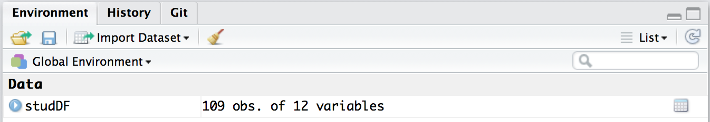
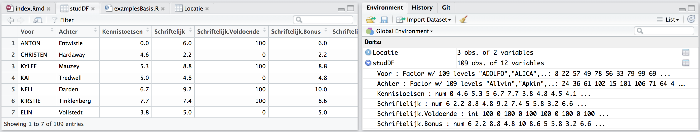

# R-Workshop
Witek ten Hove - wfth1969@gmail.com  
`r format(Sys.time(), '%d %B, %Y')`  


# Sessie 1 - Inlezen / Bekijken

In deze sessie gaan we kijken hoe je data uit verschillende bronnen kunt inlezen. We beginnen eenvoudig en lezen een lokaal opgeslagen bestand uit. Daarna gaan we data uitlezen vanuit een online spreadsheet. We eindigen met het scrapen van informatie uit een webpagina.

## Lokaal bestand

Maak een nieuw R Script aan in RStudio en bewaar het in een voor jou logische folder op je computer (geef het een zinvolle naam, bijvoorbeeld `werkSessie1.R`). Verwijs in RStudio naar deze werkfolder door te klikken op *Session >> Set Working Directory >> To Source File Location*

Download nu het volgende databestand: <a href="https://github.com/witusj/R-workshop/raw/gh-pages/datasets/sessie%201/stud_perf.csv" download>Student Performance (csv)</a> en sla het op in de werkfolder. Nu ben je klaar om je eerste data in te lezen in R.

In het scriptvenster in RStudio schrijf (of kopieer) je volgende instructie:

```r
## Lees data uit lokaal csv-bestand
studDF <- read.csv("stud_perf.csv", stringsAsFactors = FALSE)
```
Selecteer alles en klik op Run. In de console van RStudio zie je dat de instructies worden uitgevoerd, maar je ziet verder geen resultaten. R heeft echter alle data in het geheugen geladen. Je kunt dit zien in het *Environment* veld waar nu een data object *studDF* is toegevoegd:



<br>
We kunnen snel controleren of de data goed is overgekomen door naar de eerste zes rijen te kijken:


```r
## Bekijk eerste regels van data
head(studDF)
```

```
##       Voor      Achter Kennistoetsen Schriftelijk Schriftelijk.Voldoende
## 1    ANTON   Entwistle           0.0          6.0                    100
## 2 CHRISTEN    Hardaway           4.6          2.2                      0
## 3    KYLEE      Mauzey           5.3          8.8                    100
## 4      KAI    Tredwell           5.0          4.8                      0
## 5     NELL      Darden           6.7          9.2                    100
## 6  KIRSTIE Tinklenberg           7.7          7.4                    100
##   Schriftelijk.Bonus Schriftelijk.Bonus.Voldoende Clicks Weblectures
## 1                6.0                          100    536         5.5
## 2                2.2                            0    636         0.8
## 3                8.8                          100    666         3.6
## 4                4.8                            0    479         1.2
## 5               10.0                          100    298         0.0
## 6                8.6                          100    863         0.0
##   BEC.Propedeuse AEC.Propedeuse Vooropleiding
## 1              1              1          HAVO
## 2              0              0           MBO
## 3              1              1           MBO
## 4              1              1          HAVO
## 5              1              1          HAVO
## 6              1              1           MBO
```

<br>
Het gaat hier klaarblijkelijk om een cijferlijst van studenten met wat metadata. Alles lijkt correct te zijn ingelezen door R en we kunnen nu wat nauwkeuriger kijken naar de data. Het is een goede gewoonte om eerst de structuur van de data te onderzoeken:


```r
## Bekijk de structuur van data
str(studDF)
```

```
## 'data.frame':	109 obs. of  12 variables:
##  $ Voor                        : chr  "ANTON" "CHRISTEN" "KYLEE" "KAI" ...
##  $ Achter                      : chr  "Entwistle" "Hardaway" "Mauzey" "Tredwell" ...
##  $ Kennistoetsen               : num  0 4.6 5.3 5 6.7 7.7 3.8 4.8 4.5 4.1 ...
##  $ Schriftelijk                : num  6 2.2 8.8 4.8 9.2 7.4 5 5.8 3.2 6.6 ...
##  $ Schriftelijk.Voldoende      : int  100 0 100 0 100 100 0 100 0 100 ...
##  $ Schriftelijk.Bonus          : num  6 2.2 8.8 4.8 10 8.6 5 5.8 3.2 6.6 ...
##  $ Schriftelijk.Bonus.Voldoende: int  100 0 100 0 100 100 0 100 0 100 ...
##  $ Clicks                      : int  536 636 666 479 298 863 434 428 441 1058 ...
##  $ Weblectures                 : num  5.5 0.8 3.6 1.2 0 0 0 0 0 1.2 ...
##  $ BEC.Propedeuse              : int  1 0 1 1 1 1 1 0 0 1 ...
##  $ AEC.Propedeuse              : int  1 0 1 1 1 1 1 1 0 1 ...
##  $ Vooropleiding               : chr  "HAVO" "MBO" "MBO" "HAVO" ...
```

<br>
en we zien dat de data de vorm van een *data frame* (tabel) heeft met 109 rijen (observaties) en 12 kolommen (variabelen). De eerste variabele heet `Voor` en de elementen bestaan uit letters (`chr`). De derde variabele heet `Kennistoetsen` en de elementen zijn getallen (`num`). De vijfde variabele heet `Schriftelijk.Voldoende` en bestaat uit gehele getallen (`int`).

Met `summary()` kunnen we de kwaliteit van de data beoordelen:


```r
## Bekijk de kwaliteit van data
summary(studDF)
```

```
##      Voor              Achter          Kennistoetsen   Schriftelijk  
##  Length:109         Length:109         Min.   :0.00   Min.   :0.800  
##  Class :character   Class :character   1st Qu.:3.20   1st Qu.:4.000  
##  Mode  :character   Mode  :character   Median :4.80   Median :5.600  
##                                        Mean   :4.48   Mean   :5.503  
##                                        3rd Qu.:5.70   3rd Qu.:6.800  
##                                        Max.   :8.30   Max.   :9.600  
##                                                                      
##  Schriftelijk.Voldoende Schriftelijk.Bonus Schriftelijk.Bonus.Voldoende
##  Min.   :  0.00         Min.   : 0.800     Min.   :  0.00              
##  1st Qu.:  0.00         1st Qu.: 4.000     1st Qu.:  0.00              
##  Median :100.00         Median : 5.600     Median :100.00              
##  Mean   : 52.29         Mean   : 5.787     Mean   : 53.21              
##  3rd Qu.:100.00         3rd Qu.: 7.600     3rd Qu.:100.00              
##  Max.   :100.00         Max.   :10.000     Max.   :100.00              
##                                                                        
##      Clicks        Weblectures     BEC.Propedeuse  AEC.Propedeuse  
##  Min.   :   1.0   Min.   :0.0000   Min.   :0.000   Min.   :0.0000  
##  1st Qu.: 269.0   1st Qu.:0.0000   1st Qu.:1.000   1st Qu.:1.0000  
##  Median : 386.0   Median :0.0000   Median :1.000   Median :1.0000  
##  Mean   : 445.7   Mean   :0.8505   Mean   :0.875   Mean   :0.9327  
##  3rd Qu.: 541.0   3rd Qu.:1.2000   3rd Qu.:1.000   3rd Qu.:1.0000  
##  Max.   :1058.0   Max.   :6.8000   Max.   :1.000   Max.   :1.0000  
##                                    NA's   :5       NA's   :5       
##  Vooropleiding     
##  Length:109        
##  Class :character  
##  Mode  :character  
##                    
##                    
##                    
## 
```
<br>
We kunnen hieruit onder andere aflezen dat de gemiddelde score van de kennistoetsen 4.48 bedroeg met een maximum van 8.3 en dat bij de variabele `BEC.Propedeuse` van 5 observaties de gegevens ontbreken (`NA`).

Door in het *Environment* veld op de variabele `StudDF` te klikken (of in de *Console* met het commando `View(studDF)`), krijg je een tabel met alle data.



### Vragenset 1A
1. Hoeveel procent van de studenten heeft voor het schriftelijk tentamen (inclusief bonuspunten) een voldoende gehaald?

2. In hoeveel procent van de gevallen hadden studenten de bonuspunten nodig om voor het schriftelijk een voldoende te halen?

## Online bestand
We kunnen met R ook heel makkelijk data ophalen die online is opgeslagen. In dit voorbeeld lezen we data uit een Google Spreadsheet uit. Er zijn verschillende packages die voor deze taak geschikt zijn. Wij gaan de package `gsheet` gebruiken.


```r
## Laad de benodigde package(s)
library(gsheet)

## Lees online data in
url <- "https://docs.google.com/spreadsheets/d/1YnAdYzJ6hAHlFTbgv2xMxkMwGyAcFM8zM1FMnEkJKgw/edit?usp=sharing"
surveyDF <- gsheet2tbl(url)
```

### Vragenset 1B
1. Om wat voor een soort data gaat het hier?

2. Welke dimensies heeft de dataset (rijen / kolommen)?

3. Welke classes hebben de variabelen?

4. Wat is het gemiddelde niveau van de ingeschatte vaardigheden?


## Web scraping
Een andere wijze om online data te verzamelen is via *web scraping*. Soms zie je op webpagina's tabellen met data staan, zoals bijvoorbeeld [hier](http://www.pginvestor.com/Historic-Prices). Met de `rvest` package kunnen we de data uit de html code filteren.


```r
# Laad de benodigde package(s)
library(rvest)

# Lees ruwe html data in.
htmlpage <- read_html("http://www.pginvestor.com/Historic-Prices")

# Extraheer alle tabellen uit de ruwe data
nodes <- html_nodes(htmlpage, "table")
tables <- html_table(nodes, fill = TRUE)

# Kies een tabel en stop de data in een data frame
stockDF <- tables[1][[1]]
```

### Vragenset 1C
1. Wat voor een soort data bevat `stockDF`?

2. Welke classes hebben de variabelen?

3. Wat was de hoogste waarde voor de variabele`Price`?
